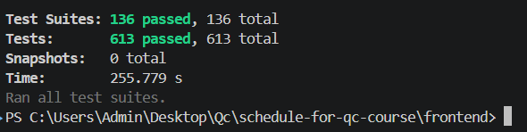
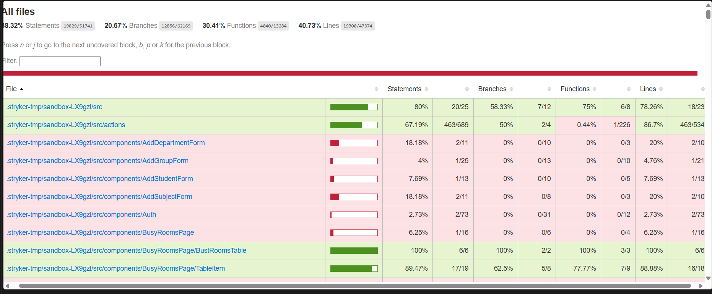
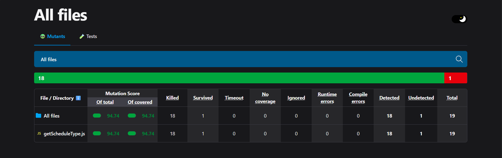
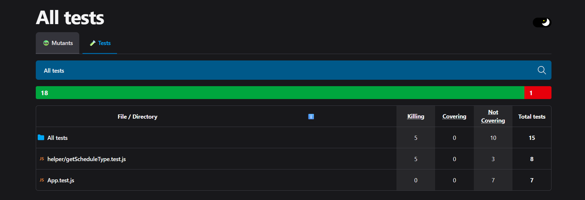

# Coverage Report

## Загальне покриття
- Statements: ~38.32%
- Branches: 20.67%
- Functions: ~30.45%
- Lines: ~40.73%

## Аналіз

- Найкраще покриття мають helper-функції (зокрема getScheduleType та інші утиліти), оскільки для них написані unit-тести з перевіркою різних сценаріїв (нормальні значення, null, undefined, пусті об’єкти).
- UI частина проєкту (App.js та renderScheduleTable helpers) має значно нижче покриття, оскільки містить складну логіку рендеру та залежить від багатьох умов і станів.
- Загальне branch coverage нижче через те, що не всі умовні гілки (if/else) були протестовані, особливо edge cases.
- Частина коду тестується лише частково через інтеграційний характер деяких компонентів, а не ізольовані unit-тести.

## Скріншот

